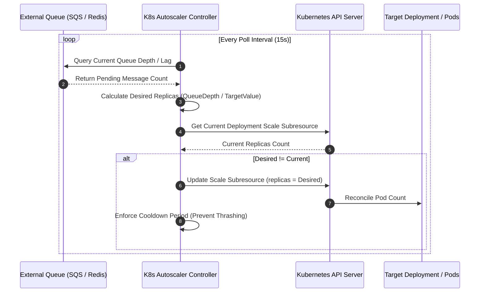

# k8s-pod-autoscale

> Custom **Kubernetes Controller & Autoscaler** built with Go and `client-go` that scales Deployments dynamically based on external queue depths and custom Prometheus metrics.

[](https://golang.org)
[](https://github.com/kubernetes/client-go)
[](https://github.com/txltedxgod/k8s-pod-autoscale/actions)
[](https://docker.com)
[](LICENSE)

`#kubernetes` `#k8s-controller` `#client-go` `#autoscaling` `#devops` `#cloud-native` `#golang`

---

## 🏛️ Controller Reconcile Loop



---

## Features

- **Queue & Metric-Driven Scaling:** Scale workloads based on real processing backlogs (RabbitMQ, SQS, Redis Stream lag) rather than lagging CPU/Memory heuristics.
- **Custom In-Cluster Controller:** Implements `client-go` Informers, WorkQueues, and Leader Election for high-availability production clusters.
- **Flapping Prevention:** Configurable scale-up / scale-down stabilization windows and cooldown damping.
- **RBAC Manifests Included:** Production-ready `ClusterRole`, `ServiceAccount`, and `Deployment` configurations.

## Quick Start

### 1. Apply RBAC and CRD/Deployments

```bash
kubectl apply -f deploy/rbac.yaml
kubectl apply -f deploy/deployment.yaml
```

### 2. Run Locally with Kubeconfig

```bash
go run main.go -kubeconfig=$HOME/.kube/config -namespace=default
```
